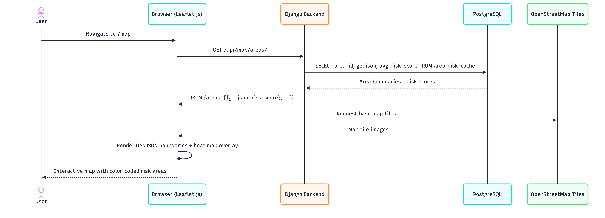
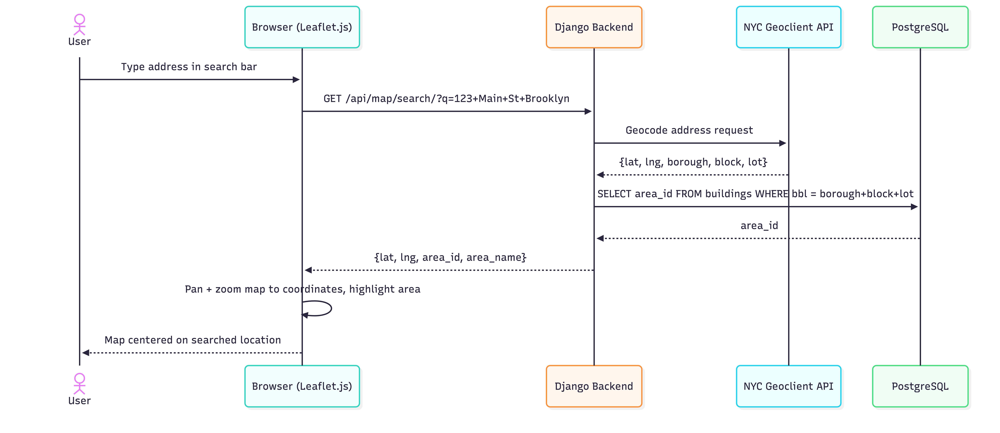
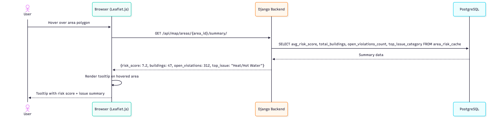
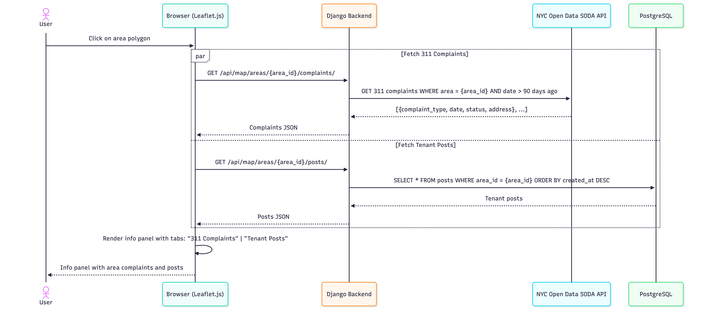
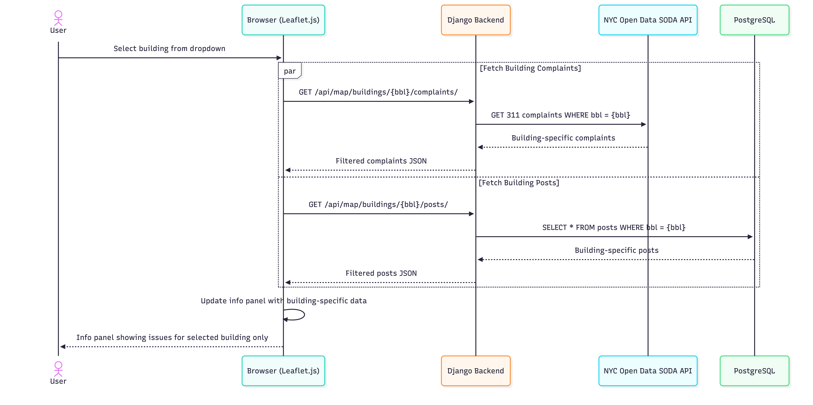
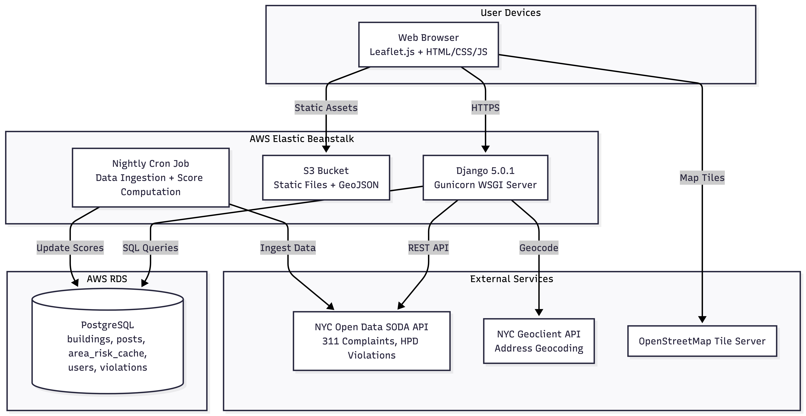

# High Level Design

## Epic: NYC Areawise Interactive Map

This design covers the **NYC Areawise Interactive Map** epic — the primary entry point for all users of TenantGuard NYC. Through this epic, tenants, prospective renters, organizers, and journalists can visually explore NYC neighborhoods by housing risk, view 311 complaints, read tenant posts, and drill down to individual buildings.

### Why UML?

We use **sequence diagrams** because they clearly capture the request-response flow between our frontend (Leaflet.js), Django backend, PostgreSQL database, and external NYC APIs — which is the core complexity of this epic. We also include a **deployment diagram** to show how components map to our AWS infrastructure. We chose not to use class diagrams at this stage since Django's ORM models serve as living class documentation.

---

## Load Map with Heat Map (Stories #14, #15)

When a user navigates to the map page, the system loads NYC area boundaries and pre-computed risk scores to render the heat map. Risk scores are computed **nightly in batch**, not on each request.

 

---

## Search by Address (Story #20)

User types an address; the system geocodes it via NYC Geoclient API and repositions the map to the matching area.

 

---

## Hover Over Area for Summary (Story #16)

Hovering over an area shows a tooltip with the risk score and top issue. A 300ms debounce prevents excessive requests; responses are cached client-side per area.

 

---

## Click Area — View 311 Complaints & Tenant Posts (Stories #17, #18)

Clicking an area opens an info panel. 311 complaints are fetched **real-time from NYC Open Data** (SODA API) while tenant posts come from our local database. Both requests fire in **parallel**.

 

---

## Filter by Specific Building (Story #19)

Within an area, the user can filter to see issues for a single building. Uses BBL (Borough-Block-Lot) as the identifier. Only the info panel updates — the map does not reload.

 

---

## Deployment Diagram

Shows how TenantGuard NYC components are deployed on AWS infrastructure and how they connect to external NYC data services.

 

---

## Story-to-Diagram Mapping

| Story | Description | Diagram |
|-------|-------------|---------|
| #14 | Visual map of NYC with area boundaries | Load Map |
| #15 | Heat map of areas by severity score | Load Map (heat layer) |
| #16 | Hover over area for score + issue summary | Hover Summary |
| #17 | See tenant posts for an area | Click Area (Posts tab) |
| #18 | See 311 complaints for an area | Click Area (Complaints tab) |
| #19 | Filter issues by specific building | Filter by Building |
| #20 | Search by address to jump to area | Search by Address |
